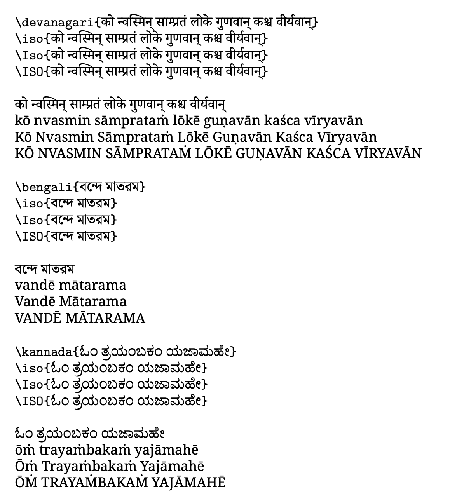

# Indian Scripts Transliteration in LaTeX

*Write in ANY script (supported by `indic-transliteration`) to render as ISO, etc.*

There exist several input systems based on these transliteration schemes to enable users easily input the text. More often than not, a user has a preference of scheme to type the input in. With advent of advanced text input methods for Indian languages, it has become easier to input text in native scripts. At the same time, one often faces a need to render the text in a more standard scheme when creating a PDF document for a wider audience.

For example, I prefer using [`ibus-m17n`](https://launchpad.net/ubuntu/+source/ibus-m17n) to type text in Devanagari or other Indian languages such as Bengali and so on. While writing articles that contain text in native scripts, I also faced the need to render the text as using ISO scheme in the final PDF. One could always learn to input text in another input scheme, but that may get tedious. Similarly, transliterating each word using online systems such as [Aksharamukha](https://aksharamukha.appspot.com/converter) can also be a tedious task. So, I was looking for a way where I can type in native scripts, and have it rendered in ISO after PDF compilation. As a solution, I came up with a system consisting of a small set of LaTeX commands to add custom syntax to LaTeX and a python transliteration script (based on [`indic-transliteration`](http://pypi.org/indic-transliteration) package) to serve as a middle-layer and process the LaTeX file to create a new LaTeX file with proper transliteration.

*Full Article (coming soon)*

## Instructions

* Create your own latex file, say `minimal.tex`
* Add the following lines in the preamble of the LaTeX file for some sample native scripts and ISO support,

```latex

% This assumes your files are encoded as UTF8
\usepackage[utf8]{inputenc}

% Unicode Related Packages
\usepackage{fontspec, xunicode, xltxtra}

% Define Fonts
\newfontfamily\textdevanagari[Script=Devanagari]{Noto Serif Devanagari}
\newfontfamily\textbengali[Script=Bengali]{Noto Serif Bengali}
\newfontfamily\texttelugu[Script=Telugu]{Noto Serif Telugu}
\newfontfamily\textkannada[Script=Kannada]{Noto Serif Kannada}

\newfontfamily\textiso{Noto Serif}

% Commands for Indian Language Transliterations
\newcommand{\devanagari}[1]{{\textdevanagari{#1}}}
\newcommand{\bengali}[1]{{\textbengali{#1}}}
\newcommand{\telugu}[1]{{\texttelugu{#1}}}
\newcommand{\kannada}[1]{{\textkannada{#1}}}

\newcommand{\iso}[1]{{\textiso{#1}}}
\newcommand{\Iso}[1]{{\textiso{#1}}}
\newcommand{\ISO}[1]{{\textiso{#1}}}
```

* Use `\iso{}`, `\Iso{}` or `\ISO{}` tags to render text in native scripts in ISO format in lower case, title case and upper case respectively.
* **Note**: The commands `\iso{}`, `\Iso{}` and `\ISO{}` are identical from the perspective of LaTeX engine. They are just different syntactically to aid the python script to perform transliteration and apply appropriate modifications.

* Type the following command in the terminal,

```console
python3 finalize.py minimal.tex final.tex
```
* Proceed to compile the `final.tex` file

```console
xelatex final
```
* Result



### Extras

Additional structure can be added to the LaTeX setup, such as,

* Check TeX contents in `main.tex`
* Separation of content into multiple files

```latex
\input{sections/introduction.tex}
\input{sections/transliteration.tex}
\input{sections/conclusion.tex}
```

* Bibliography

```latex
\bibliographystyle{acm}
\bibliography{papers}
```

#### Final LaTeX Preparation

`latexpand` utility resolves the `\input{}` commands to actually include the content and create a single consolidated LaTeX file.

```console
latexpand main.tex > single.tex
```

Now, we can resolve the transliteration tags.
```console
python3 finalize.py main.tex final.tex
```

#### Compilation

When working with BibTeX, we often need to multiple times to get the correct rendering of references in the PDF. Usually, this requires

```console
xelatex final
bibtex final
xelatex final
xelatex final
```

`latexmk` utiliaty can take care of the tedious compilation routines and reduce our job to a single command,

```console
latexmk -pdflatex='xelatex %O %S' -pdf -ps- -dvi- final.tex
```

Another benefit of using `latexmk` is, we can clean the numerous files generated by LaTeX engine using a one-liner as well,

```console
latexmk -c
```

### Requirements

We have made use of a number of external tools, and it is required to have these setup prior to the described solution.

#### Minimal Requirements

* XeLaTeX (unicode support) (included in [TeX Live](https://www.tug.org/texlive/))
* [Python3](https://www.python.org/downloads/)
* [`indic-transliteration`](https://pypi.org/project/indic-transliteration/)

#### Extra Requirements

* [latexpand](https://ctan.org/pkg/latexpand?lang=en) (optional) (resolve `\input{}`)
* [BibTeX](http://www.bibtex.org/) (optional) (bibliography support)
* [latexmk](https://mg.readthedocs.io/latexmk.html) (optional) (simpler TeX compilation)

## Native Fonts

Google Fonts also provides a [wide variety of fonts](https://fonts.google.com/) with support for Indian scripts.

## Structure

```console
.
├── README.md
├── Makefile
├── finalize.py
├── minimal.tex
├── minimal.png
├── main.tex
├── sections
│   ├── introduction.tex
│   ├── transliteration.tex
│   └── conclusion.tex
└── papers.bib
```
