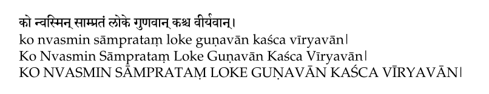

# Devanagari Transliteration in LaTeX

*Write in Devanagari to render as IAST, Harvard-Kyoto, Velthuis, SLP1, WX etc.*

> Devanagari text can be transliterated in various [standard schemes](https://en.wikipedia.org/wiki/Devanagari_transliteration). There exist several input systems based on these transliteration schemes to enable users easily input the text. More often than not, a user has a preference of scheme to type the input in. Similarly, at times, one faces a need to render it in a different scheme in the PDF document.
>
> In my case, I prefer using [`ibus-m17n`](https://launchpad.net/ubuntu/+source/ibus-m17n) to type text in Devanagari. While writing articles that contain Devanagari text, I also faced the need to render the text as IAST in the final PDF.
> One could always learn to input text in another input scheme, but that may get tedious. Similarly, transliterating each word using online systems such as [Aksharamukha](https://aksharamukha.appspot.com/converter) can also be a tedious task. So, I was looking for a way where I can type in Devanagari, and have it rendered in IAST after PDF compilation. As a solution, I came up with a system consisting of a small set of LaTeX commands to add custom syntax to LaTeX and a python transliteration script (based on [`indic-transliteration`](http://pypi.org/indic-transliteration) package) to serve as a middle-layer and process the LaTeX file to create a new LaTeX file with proper transliteration.

[[**Full Article**]](https://hrishikeshrt.github.io/post/devanagari-transliteration-in-latex/)

## Instructions

* Write TeX content in `minimal.tex`
* Add the following lines in the preamble of the LaTeX file for Devanagari and IAST support,

```latex

% This assumes your files are encoded as UTF8
\usepackage[utf8]{inputenc}

% Devanagari Related Packages
\usepackage{fontspec, xunicode, xltxtra}

% Define Fonts
\newfontfamily\textskt[Script=Devanagari]{Sanskrit 2003}
\newfontfamily\textiast{Noto Serif}

% Commands for Devanagari Transliterations
\newcommand{\skt}[1]{{\textskt{#1}}}
\newcommand{\iast}[1]{{\textiast{#1}}}
\newcommand{\Iast}[1]{{\textiast{#1}}}
\newcommand{\IAST}[1]{{\textiast{#1}}}
```

* Use `\iast{}`, `\Iast{}` or `\IAST{}` tags to render Devanagari text in IAST format in lower case, title case and upper case respectively.
* **Note**: The commands `\iast{}`, `\Iast{}` and `\IAST{}` are identical from the perspective of LaTeX engine. They are just different syntactically to aid the python script to perform transliteration and apply appropriate modifications.

* Type the following command in the terminal,

```console
python3 finalize.py minimal.tex final.tex
```
* Proceed to compile the `final.tex` file

```console
xelatex final
```
* Result



### Extras

Additional structure can be added to the LaTeX setup, such as,

* Separation of ontent into multiple files

```latex
\input{sections/section_devanagari.tex}
\input{sections/section_iast_lower.tex}
\input{sections/section_iast_title.tex}
\input{sections/section_iast_upper.tex}
```

* Bibliography

```latex
\bibliographystyle{acm}
\bibliography{papers}
```

#### Final LaTeX Preparation

`latexpand` utility resolves the `\input{}` commands to actually include the content and create a single consolidated LaTeX file.

```console
latexpand main.tex > single.tex
```

Now, we can resolve the transliteration tags.
```console
python3 finalize.py main.tex final.tex
```

#### Compilation

When working with BibTeX, we often need to multiple times to get the correct rendering of references in the PDF. Usually, this requires

```console
xelatex final
bibtex final
xelatex final
xelatex final
```

`latexmk` utiliaty can take care of the tedious compilation routines and reduce our job to a single command,

```console
latexmk -pdflatex='xelatex %O %S' -pdf -ps- -dvi- final.tex
```

Another benefit of using `latexmk` is, we can clean the numerous files generated by LaTeX engine using a one-liner as well,

```console
latexmk -c
```

### Requirements

We have made use of a number of external tools, and it is required to have these setup prior to the described solution.

#### Minimal Requirements

* XeLaTeX (unicode support) (included in [TeX Live](https://www.tug.org/texlive/))
* [Python3](https://www.python.org/downloads/)
* [`indic-transliteration`](https://pypi.org/project/indic-transliteration/)

#### Extra Requirements

* [latexpand](https://ctan.org/pkg/latexpand?lang=en) (optional) (resolve `\input{}`)
* [BibTeX](http://www.bibtex.org/) (optional) (bibliography support)
* [latexmk](https://mg.readthedocs.io/latexmk.html) (optional) (simpler TeX compilation)

## Devanagari Fonts

Nowadays, there are several good Devanagari fonts available. Google Fonts also provides a [wide variety of Devanagari fonts](https://fonts.google.com/?subset=devanagari).

Two of my personal favourites are,

* [Sanskrit 2003](https://omkarananda-ashram.org/Sanskrit/itranslator2003.htm#dls)
* [Noto Serif Devanagari](https://fonts.google.com/noto/specimen/Noto+Serif+Devanagari)

## Structure

```console
.
├── README.md
├── Makefile
├── finalize.py
├── fonts
│   └── Sanskrit2003.ttf
├── minimal.tex
├── minimal.png
├── main.tex
├── sections
│   ├── section_devanagari.tex
│   ├── section_iast_lower.tex
│   ├── section_iast_title.tex
│   └── section_iast_upper.tex
└── papers.bib
```
